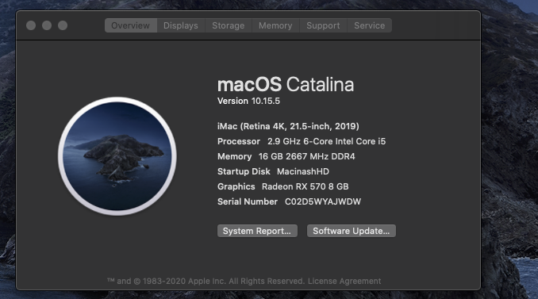
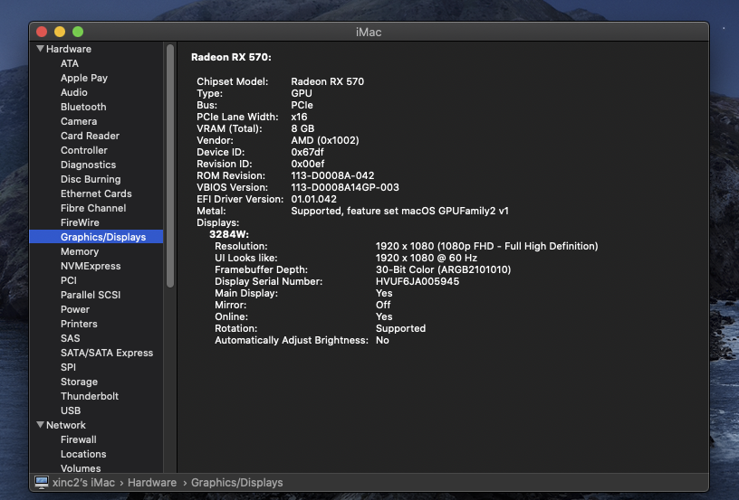
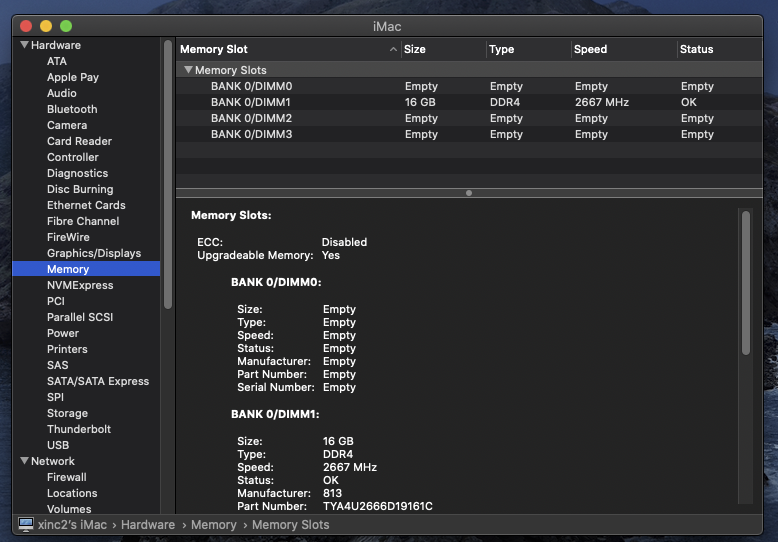
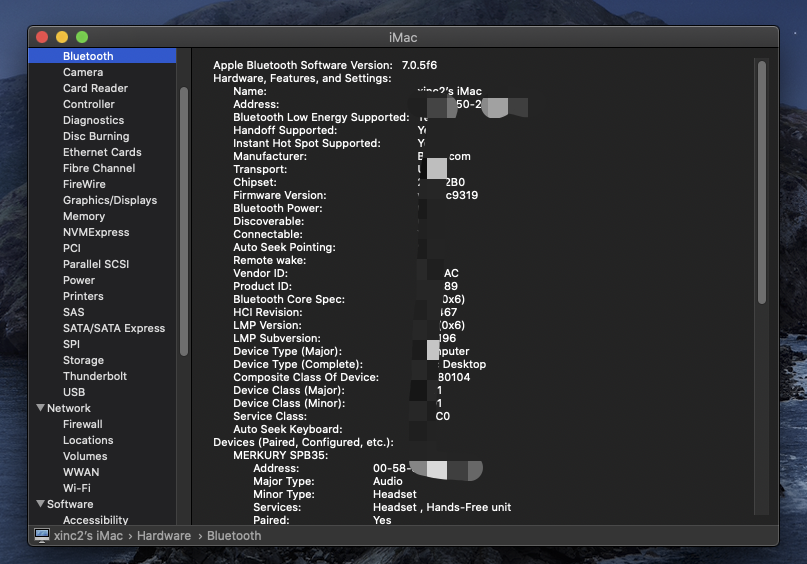

# 配置
硬件  | 型号
---  | :--
主板  | 微星 B360M 迫击炮
处理器 | 英特尔酷睿 i4-9400F
显卡 |	蓝宝石(Sapphire RX580 2048SP 8G; 我的原装vBIOS: `Hynix_H5GC8H24AJR_PARTNER_SAPPHIRE`) `入坑，千万别选RX580 2048sp这款，对黑苹果不友好，不免驱。折腾很久才降级成 RX570 的vBIOS`
硬盘  |	西部数据 1T m.2 + 阿特斯加 250G SSD(选装，我主要用来做win10,可以不需要)
内存  |	光威悍将Type-a 16GB DDR4 2666MHz x 1
无线 + 蓝牙 |	奋威 BCM94360CD（双频 1750M + 蓝牙 4.0）PCI-E 无线网卡
机箱 + 电源 + 散热 | 	爱国者炫影黑(`不推荐，做工真的很差，后盖板特别难扣上去`) + 鑫谷GP700G黑金600W +  九州玄冰X400
显示器 |	AOC（32 英寸 1080p 分辨率）
键盘  |	VPRO（有线茶轴 RGB 版）
鼠标  |	XIAOMI（蓝牙）

# BIOS 设置 [`感谢` 来自github@GeQ1an](https://github.com/GeQ1an/MSI-B360M-MORTAR-HACKINTOSH-OPENCORE-EFI)

## 请先确定正在使用的 BIOS 版本，迫击炮 7B23v16 以上，迫击炮钛金版 7B23vA6 以上。

- STTINGS\高级\PCI子系统设置\Above 4G memory/Crypto Currency mining [允许]
- STTINGS\高级\ACPI设置\电源 LED 灯 [双色]（如果选择 [闪烁]，睡眠时电源灯将不断闪烁）
- STTINGS\高级\USB设置\XHCI Hand-off [允许]
- STTINGS\高级\USB设置\传统USB支持 [允许]
- STTINGS\高级\电源管理设置\ErP Ready [允许]
- STTINGS\高级\Windows操作系统的配置\Windows 10 WHQL支持 [允许]（开启为「纯」UEFI 模式，否则为「兼容」UEFI 模式，推荐设置为允许）
- STTINGS\高级\Windows操作系统的配置\MSI 快速开机 [禁止]
- STTINGS\高级\Windows操作系统的配置\快速开机 [禁止]
- STTINGS\高级\唤醒事件设置\唤醒事件管理 [BIOS]
- STTINGS\高级\唤醒事件设置\USB设备从S3/S4/S5唤醒 [允许]
- STTINGS\启动\启动NumLock状态 [关]（macOS 默认可使用数字键盘，只有 macOS 的话推荐关闭）
- STTINGS\启动\启动模式选择 [UEFI]
- OC(Overclocking)\CPU 特征\Intel 虚拟化技术 [允许]（必须）
- OC(Overclocking)\CPU 特征\Intel VT-D 技术 [禁止]（必须）
- OC(Overclocking)\CPU 特征\CFG锁定 [禁止]（必须）

# EFI
- `我的EFI` -> `EFI`
    
# 安装过程:
  - 具体镜像制作，磁盘格式化以及安装过程参见下面步骤，感谢`国光`教程 

    [黑苹果安装过程](https://www.sqlsec.com/2018/08/clover.html "黑苹果安装过程")

# 显卡降级: 从原版的 RX580 -> RX570
- 具体vBIOS降级方法可以参见这个网址: [RX580 2048sp vBIOS降级]("https://osx.cx/rx580-2048sp-shua-vbios-rx570.html")
- 我用的 RX570 vBIOS: 
    - `tools/GPU_BIOS_ROM_TOOLS/bios_rx570_hynix_H5GC8H24AJR_PARTNER_SAPPHIRE.rom`

# 成品
- overview

- GPU

- Memory

- Bluetooth
